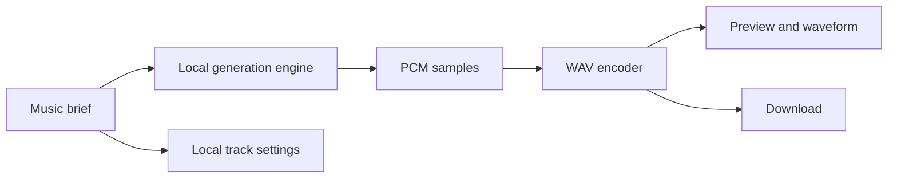

<div align="center">
  
  <h1>Toneara</h1>
  <p><strong>Make the music you imagine.</strong></p>
  <p>A browser-first AI-assisted studio for creating, remixing, previewing, and exporting original instrumentals.</p>

  [](https://github.com/drewc611/TONEARA/releases)
  [](https://github.com/drewc611/TONEARA/actions/workflows/ci.yml)
  [](https://github.com/drewc611/TONEARA/actions/workflows/codeql.yml)
  [](LICENSE)
</div>


## What it does

Describe a sound, choose a genre and mood, set the tempo, and generate a playable instrumental directly in the browser. Toneara renders a waveform, supports seeking and remix variations, remembers recent settings on the device, and exports a WAV file.

The release candidate needs no account, API key, backend, or paid generation provider. Prompts and track settings stay in the browser.

## Release-candidate features

- Prompt-to-instrumental generation
- Electronic, hip-hop, ambient, and cinematic palettes
- Focused, uplifting, dark, and dreamy moods
- Tempo and 10, 20, or 30-second duration controls
- Twelve deterministic variations per brief
- Waveform, playback, seeking, regeneration, and WAV export
- Device-local recent-track library
- Portable, validated Toneara project import and export
- Installable progressive web application with offline startup
- Strict browser content security policy with no third-party runtime requests
- Responsive desktop and mobile interface

## How it works



## Run locally

Requires Node.js 20 or newer.

```bash
git clone https://github.com/drewc611/TONEARA.git
cd TONEARA
npm run verify
python3 -m http.server 4173 --directory app
```

Open `http://localhost:4173`.

## Repository map

| Path | Purpose |
|---|---|
| `app/` | Shippable browser application |
| `test/` | Deterministic engine tests |
| `server/` | Server-side hosted-provider adapter, rate limiting, and instrumentation (not deployed) |
| `scripts/` | Dependency-free validation and build |
| `docs/` | Product, architecture, privacy, threat model, security operations, support matrix, and roadmap |
| `.github/agents/` | Guarded GitHub Copilot custom-agent team |
| `.github/workflows/` | CI, security, Pages, agent governance, and releases |

## Product direction

The local engine and provider-neutral job contract deliver the complete credential-free experience. A later hosted-provider adapter can use the same contract while keeping provider keys off the client.

See the [product requirements](docs/PRODUCT_REQUIREMENTS.md), [architecture](docs/ARCHITECTURE.md), [roadmap](docs/ROADMAP.md), [security operations](docs/SECURITY_OPERATIONS.md), [browser support](docs/BROWSER_SUPPORT.md), and [AI team operating model](docs/AGENT_OPERATING_MODEL.md).

## Ownership and license

Toneara is proprietary software. Source is visible for evaluation, but reuse, redistribution, hosted deployment, derivative works, and commercial use require written permission. See [LICENSE](LICENSE).

Copyright © 2026 Andrew Clark. All rights reserved.
