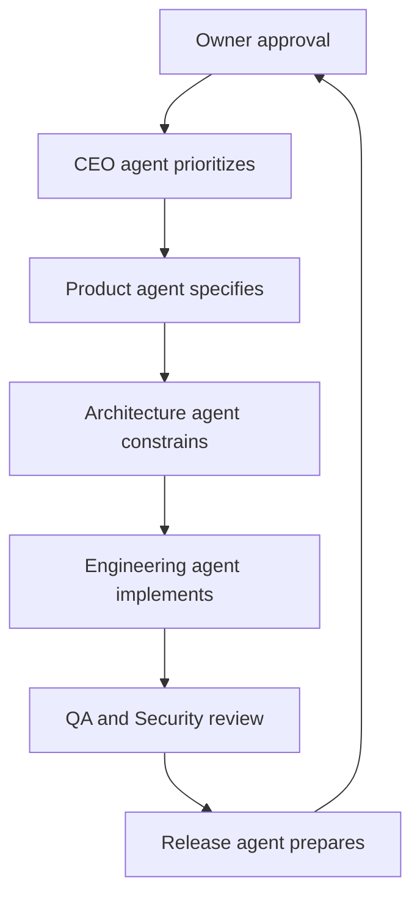

# AI Team Operating Model

Toneara's GitHub custom agents are specialized contributors, not autonomous executives with merge authority.

## Guardrails

- Work starts from an issue with acceptance criteria.
- One issue maps to one focused branch and pull request.
- Agents never merge their own work or bypass checks.
- No agent may add secrets, weaken security, alter the license, publish a release, or expand data collection.
- Generated output is treated as untrusted until tests and owner review pass.
- Agents must stop and request a decision when scope, rights, cost, privacy, or destructive actions are unclear.
