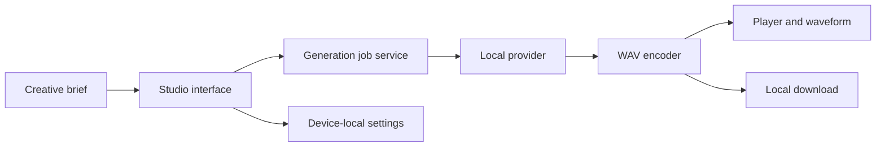

# Architecture

Toneara v0.1 is a zero-backend web application. The browser converts a creative brief into deterministic PCM samples, packages them as WAV, and retains only lightweight settings in local storage. Generation is accessed through a provider-neutral job service so the interface does not depend on one music engine.

## Boundaries

- `app/index.html`: accessible product surface
- `app/app.js`: interface state and browser integrations
- `app/generation-service.mjs`: request validation, job lifecycle, provider selection, cancellation, and fallback
- `app/music-engine.mjs`: deterministic generation and WAV encoding
- `app/project-file.mjs`: versioned, validated project portability contract
- `app/styles.css`: responsive design system
- `test/`: engine contract tests
- `scripts/`: dependency-free build and validation

## Provider evolution

Providers implement one `generate(request, context)` contract. The browser currently selects the local provider. A hosted adapter must be called through a server-side endpoint, keep credentials out of browser code, persist job state, enforce rate limits, document content policy and rights, and retain the local provider as a safe fallback.
