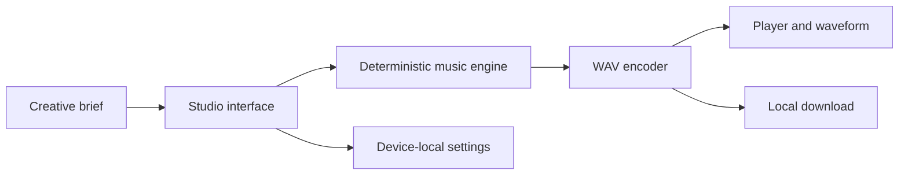

# Architecture

Toneara v0.1 is a zero-backend web application. The browser converts a creative brief into deterministic PCM samples, packages them as WAV, and retains only lightweight settings in local storage.

## Boundaries

- `app/index.html`: accessible product surface
- `app/app.js`: interface state and browser integrations
- `app/music-engine.mjs`: deterministic generation and WAV encoding
- `app/styles.css`: responsive design system
- `test/`: engine contract tests
- `scripts/`: dependency-free build and validation

## Provider evolution

The music engine is isolated so a hosted provider adapter can be introduced later. That phase must keep provider secrets server-side, add job-state persistence, document content policy and rights, and retain a local demo mode.
